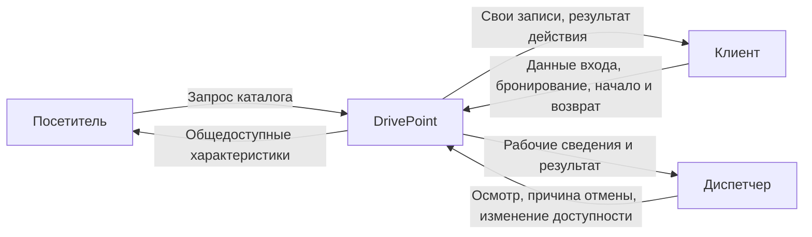
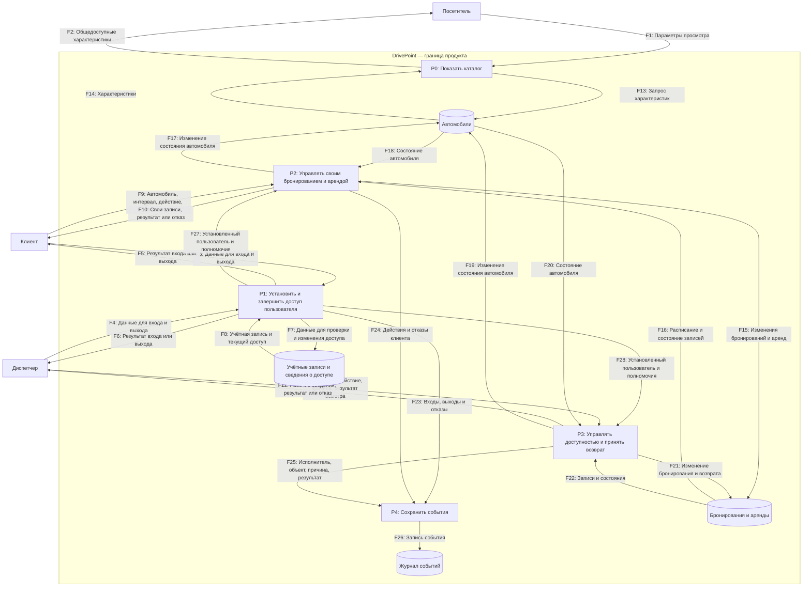
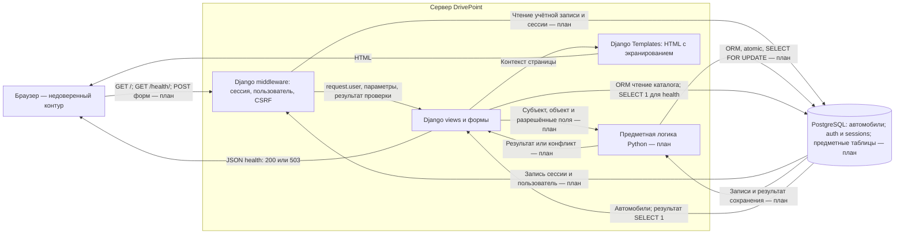

# Модель угроз DrivePoint

## Модель продукта

Назначение, роли и граница: [PROJECT.md](PROJECT.md).

**Что уже существует:** паспорт и требования безопасности. Техническая основа
готовится отдельными частями M1–M3. После объединения и успешного запуска
она будет включать сервер, каталог учебных автомобилей и проверку соединения
с хранилищем. Наличие схемы не подтверждает реализацию.

**Что пока планируется:** вход и выход, клиентские бронирования и аренды,
операции диспетчера, журнал событий и соответствующие механизмы защиты.

**Существенные допущения:** используются учебные данные; браузер любой роли
считается недоверенным; прямого доступа клиентов к хранилищу нет; роли создаёт
команда вне веб-интерфейса; начальный запуск локальный; внешнее размещение
требует пересмотра конфигурации. Платежей, телематики и внешних прикладных
сервисов нет. Модель показывает один продукт, а не набор микросервисов.

### Уровень 0 — контекст

### Уровень 1 — логическая DFD

На этом уровне указаны действия и данные без названий технологий.
Все процессы находятся внутри границы DrivePoint; внешние субъекты — вне её.
Входы от субъектов пересекают TB-01; служебные действия требуют TB-02.

### Уровень 2 — физическое представление

Это техническое представление тех же процессов и данных, а не другая модель.
Сейчас подготавливаются только GET / и GET /health/; остальные маршруты —
направление реализации, их наличие и точные имена ещё не утверждаются.

Планируемые формы бронирования передают car_id, start и end; действия над
записями — ID и команду; диспетчер передаёт причину и результат осмотра.
Внешние POST будут содержать CSRF-токен, браузер предъявляет session cookie.
Пользователь и роль устанавливаются сервером, а не значениями owner_id/role.
Для внешнего размещения нужен HTTPS; HTTP допускается только на localhost.

## Границы доверия

| Граница | Что пересекает | Почему требуется проверка |
| --- | --- | --- |
| TB-01: внешний субъект → процессы DrivePoint | F1, F3, F4, F9, F11; параметры и команды | Пользователь управляет данными и последовательностью запросов; вход не делает ввод доверенным |
| TB-02: клиентские полномочия → операции диспетчера | Попытка вызвать P3, поток F11 | Одна роль не предоставляет права другой; нужен серверный контроль операции |
| TB-03: приложение → хранилище | Учётные данные соединения, запросы и записи | Хранилище доступно только серверному процессу с назначенными правами; браузер не получает эти права |

Конкурентность и совместное сохранение журнала — гарантии операции,
а не дополнительные границы доверия.

## Значимые объекты и свойства

См. [PROJECT.md, раздел 5](PROJECT.md#assets).
Значимы конфиденциальность истории клиента, подлинность пользователя,
целостность расписания и эксплуатационного состояния, доступность услуги
и подотчётность действий диспетчера.

## Угрозы

STRIDE — единственная используемая классификация угроз.
S — подмена идентичности; T — изменение данных; R — отрицание действий;
I — раскрытие; D — отказ в обслуживании; E — повышение привилегий.
OWASP-категории в этот анализ не добавляются; ссылки на SR сохраняются.

Высокий приоритет: прямой путь нарушения полномочий, контекста пользователя
или основного инварианта проката. Средний: значимое нарушение с дополнительными
предпосылками либо косвенным последствием; защита не отменяется.

| ID | Сценарий угрозы (STRIDE) | Что нарушается | Граница / точка входа | Связанные SR | Приоритет и обоснование |
| --- | --- | --- | --- | --- | --- |
| T-01 | Клиент B подставляет ID бронирования/аренды A и читает или меняет чужую запись (I, T) | Конфиденциальность истории, целостность записей | TB-01, F9, P2 | [SR-11](SECURITY_REQUIREMENTS.md#sr-11) | Высокий: доступен прямой запрос от обычного клиента |
| T-02 | Клиент вызывает операцию диспетчера или подменяет роль/владельца/состояние в форме (E, T) | Полномочия и целостность автопарка | TB-01/TB-02, F9/F11 | [SR-12](SECURITY_REQUIREMENTS.md#sr-12), [SR-08](SECURITY_REQUIREMENTS.md#sr-08) | Высокий: служебная операция затрагивает общий ресурс |
| T-03 | Два клиента одновременно резервируют пересекающиеся интервалы; либо состояние меняется между проверкой и сохранением (T, D) | Достоверность расписания и доступность автомобиля | F9/F11, P2/P3, хранилища расписания и автомобилей | [SR-14](SECURITY_REQUIREMENTS.md#sr-14), [SR-13](SECURITY_REQUIREMENTS.md#sr-13) | Высокий: возможен без злого умысла, ломает основную функцию |
| T-04 | Клиент начинает аренду по отменённой брони, повторяет возврат; сбой между сохранениями оставляет состояния несовместимыми (T) | Согласованность брони, аренды и автомобиля | F9/F11, P2/P3 | [SR-06](SECURITY_REQUIREMENTS.md#sr-06), [SR-10](SECURITY_REQUIREMENTS.md#sr-10) | Высокий: прямые повторы и ошибки затрагивают состояние ресурса |
| T-05 | Посетитель различает существующий логин и многократно подбирает пароль, получая аккаунт жертвы (S) | Подлинность, конфиденциальность и целостность | TB-01, F3/F4, P1 | [SR-07](SECURITY_REQUIREMENTS.md#sr-07), [SR-15](SECURITY_REQUIREMENTS.md#sr-15) | Высокий: захваченный аккаунт даёт действия от имени жертвы |
| T-06 | Посторонний сайт инициирует изменяющий запрос, браузер предъявляет сессию жертвы, сервер принимает запрос (T, S) | Целостность действий | TB-01, F9/F11 | [SR-19](SECURITY_REQUIREMENTS.md#sr-19) | Высокий: может использовать полномочия диспетчера |
| T-07 | Посторонний составляет ссылку с исполняемым текстом в строке поиска; сервер отражает его в странице без экранирования. Диспетчер открывает ссылку, и код выполняется с его браузерным контекстом (T, E) | Контекст пользователя и целостность | F1 → F2, вывод страницы поиска | [SR-20](SECURITY_REQUIREMENTS.md#sr-20) | Высокий: недоверенный текст может попасть к привилегированной роли; поиск предусмотрен SR-05 |
| T-08 | Посторонний ранее получил данные сессии; после выхода клиента повторно предъявляет их и продолжает доступ (S) | Прекращение полномочий, конфиденциальность | F3/F9, P1/P2 | [SR-16](SECURITY_REQUIREMENTS.md#sr-16) | Высокий: выход должен завершать доступ независимо от сохранённой cookie |
| T-09 | Диспетчер отменяет бронь без сохранённого исполнителя и причины либо запись теряется при сбое (R) | Подотчётность | F11, F25/F26 | [SR-18](SECURITY_REQUIREMENTS.md#sr-18) | Средний: утрата расследования; непосредственная целостность рассмотрена отдельно |
| T-10 | Публикация рабочего секрета, подробной ошибки или внешний открытый канал раскрывает чувствительные сведения (I) | Конфиденциальность | Конфигурация, ответы, поставка кода, канал | [SR-02](SECURITY_REQUIREMENTS.md#sr-02), [SR-04](SECURITY_REQUIREMENTS.md#sr-04), [SR-17](SECURITY_REQUIREMENTS.md#sr-17) | Средний для локальной основы; секрет в публичной истории опасен и локально. Перед внешним размещением — высокий |
| T-11 | Разработчик подставляет текст поиска в запрос; клиент меняет его смысл специальной строкой (I, T) | Конфиденциальность, целостность | F1/F9, обработка поиска | [SR-05](SECURITY_REQUIREMENTS.md#sr-05) | Средний: зависит от опасного способа построения запроса; при появлении raw SQL пересмотр обязателен |
| T-12 | Подменённый или незаявленный пакет устанавливается и выполняется с правами приложения (T, I) | Целостность продукта, секреты | Получение зависимостей | [SR-03](SECURITY_REQUIREMENTS.md#sr-03) | Средний: нужны дополнительные предпосылки в поставке; не исключается из модели |
| T-13 | Клиент передаёт прошлый, обратный или чрезмерный интервал, нарушая расписание (T) | Целостность расписания | TB-01, F9, P2 | [SR-13](SECURITY_REQUIREMENTS.md#sr-13) | Средний: локальная проверка данных; ограничение интервала не защищает от любого массового запроса |

## Приоритетный набор

T-01–T-08. Это прямые пути нарушения основных свойств браузерного продукта.
Ориентир курса не является квотой: значимые CSRF, исполнение текста и повтор
завершённой сессии не исключены ради числа. Расчёт риска в баллах не требуется.

Связи приоритетного набора до будущих проверок:
- T-01/T-02/T-06 → SR-11/SR-12/SR-08/SR-19 → [D-01](decisions/D-01.md#d-01).
- T-03/T-04 → SR-14/SR-13/SR-06/SR-10 → [D-02](decisions/D-02.md#d-02).
- T-05/T-08 → SR-07/SR-15/SR-16 → [D-03](decisions/D-03.md#d-03).
- T-07 → SR-20 → [D-04](decisions/D-04.md#d-04).

T-09, T-10, T-11 и T-13 также учитываются в D-02–D-04.
Для неприоритетной T-12 решение контроля состава и целостности зависимостей
будет доработано после EK1. Новые роли, интерфейсы, внешнее размещение,
сторонние службы и обходные пути к данным требуют пересмотра модели.
